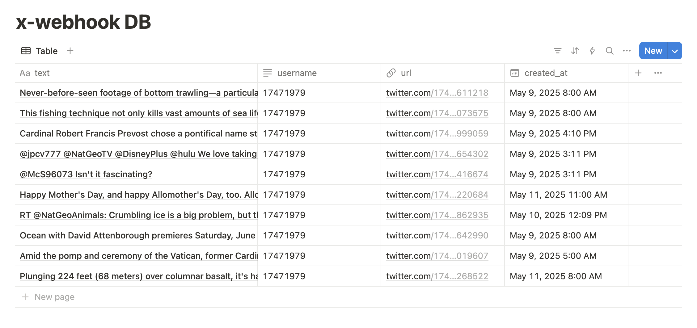

# X Webhook integration

## Summary: 

This approach explains step-by-step an API service using **NestJS with TypeScript**. Since I've the Twitter API v2, I'm not registering a **webhook URL** because it's a feature of API v1.1, and API v2 doesn't support webhooks fully

Instead, I've implemented a workaround so as to accomplish the goal of fetching and storing the tweets in Notion. I've used "Polling" API v2. That means I'm relying upon the ```@nestjs/schedule``` feature to create a Cron Job every 10 minutes, which triggers the service and stores the information in Notion as the following output:



#### Step 1: Fetch the code and Setup of Environment Variables
- Prerequisites: at least ```Node 20.x.x```
- Download the base code [here](https://github.com/EmrajiPower/x-weekhook-integration)
- Run ```npm install```
- Based on ```.env.sample``` file, create a ```.env```
   * For example:
       ```X_API_SECRET=aY0FkNNlxmuRw6BsZnT8wvw3urInRSIR2LfCTzS8nFAaGBkAak
        X_API_TOKEN=AAAAAAAAAAAAAAAAAAAAAHeY0wEAAAAALCrNC6CLyu7UCmlwRr5BaNNZmSY%3DVMjvBvAbWjiTP0SQWowo8ApDabWb4ndSs2A9zE3IYtyZhklrKM
        NOTION_TOKEN=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
        NOTION_DB_ID=1ee4505f6025806a906aec2fe6af6244
    Where ```_X_API_SECRET_``` is found in X Developer Dashboad > Consumer Keys > API Key and Secret,
    Then ```_X_API_TOKEN_``` is found in X Developer Dashboad > Authentication Tokens > Bearer Token,
    And ```_NOTION_TOKEN_``` is generated in the Integrations module of Notion API,
    Finally ```NOTION_DB_ID``` is found assigning the integration to an empty database
#### Step 2: Run the project
- Check the file ```constants.ts```, this is the root of the Twitter account id, so by default ```NATGEO``` is the target account to store the x/tweeter feed, you can add more accounts.
- Run ```npm run start:dev```

#### Step 3: POST to "webhook/x" endpoint
By sending this POST to your console (or any other API Tool), it will start the fetching process, and then the server will loop every 10 minutes the Twitter fetch Task (This time is enough to fetch tweets in a free-tier X developer account) 
```
curl -X POST http://localhost:3000/webhook/x \
  -H "Content-Type: application/json" \
  -d '{}'
```

#### Step 4: Check the response logs in the console
Essentially, logs are running in "Step" order, So ```Step 1, Step 2``` and ```Step 3```, are succed logs. But is server throws and error, it won't crash but, for example, if the Cron task fail it will prompt ```Request failed with status code 429```

# Tools

#### Check user ID for the Twitter API test: NatGeo Example
```
curl -X GET "https://api.twitter.com/2/users/by/username/NatGeo" \
       -H "Authorization: Bearer [TOKEN]"
```

#### Twitter Natgeo account: Check API constraints
```
curl -i -H "Authorization: Bearer [TOKEN]" \
       "https://api.twitter.com/2/users/17471979/tweets?tweet.fields=created_at"
```